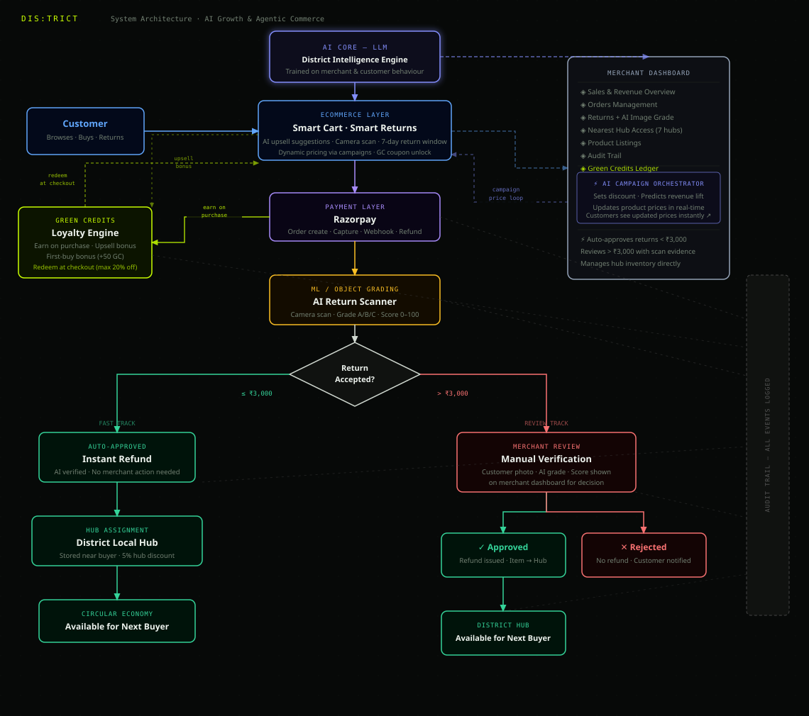

# DIS·TRICT

> **Razorpay Buildathon 2025 — Track 01: AI Growth & Agentic Commerce**

An AI-powered streetwear commerce platform where every agent action is **bounded, gated, and auditable** — built to grow merchant revenue and make merchants transactable by AI buyers, end to end, on Razorpay test-mode APIs.

### 🔗 Links

| | |
|---|---|
| 🌐 **Live Site** | [district-app-production-a225.up.railway.app](https://district-app-production-a225.up.railway.app/) |
| 🎬 **Demo Video** | [Watch on Google Drive](https://drive.google.com/file/d/1eKxSKl1c_NEjIkQgoUUI7PuOQZaerB9b/view?usp=sharing) |

---


---

## What is District?

District is a full-stack e-commerce platform for streetwear and fashion that demonstrates how AI agents can autonomously grow merchant revenue on Razorpay's test-mode APIs — while keeping every money action bounded, explainable, and safe.

Customers get a conversational shopping assistant, AI-powered upsells, a loyalty rewards system (Green Credits), and same-day delivery from local return hubs. Merchants get a real-time dashboard with AI campaign orchestration, autonomous purchasing agents, and a full audit trail of every agent decision.

## Architecture



---

## Five AI Agents

| Agent | Description | Safety Gate |
|---|---|---|
| 🤖 **AI Shopping Assistant** | Conversational in-app checkout. Natural language cart management, voice input, recipe-based grocery ordering, and Razorpay payment — all in one draggable chat panel. | Auth-gated payment |
| ⚡ **AI Upsell Agent** | Powered by Gemini 3.6 Flash. Suggests 2 complementary products with style reasoning after every add-to-cart. Accepted upsells award 20 Green Credits. | Auth required |
| 📊 **Campaign Orchestrator** | Merchant describes a goal in plain English. Agent generates a campaign plan, shows a preview of affected products and margin impact, then applies discounts on activation. | Merchant-gated, preview before activate |
| 🛒 **AI Buyer Agent** | Autonomously discovers products, creates a Razorpay order, and simulates a cryptographically-verified payment. Demonstrates full agent-to-merchant commerce. | Configurable spending limit, HMAC-verified |
| ↩ **Return Processor + ML Scanner** | Camera-based product condition scan with a 4-phase AI animation (camera → preview → scanning → result). An on-device logistic regression model grades item condition (A/B/C) and scores return risk. Orders under ₹3,000 are auto-approved instantly; higher-value returns are ML-graded and queued for merchant review. Auto-approved items are assigned to the nearest District Hub. | ML risk score · threshold-gated · hub assignment |

---

## 🤖 AI Shopping Assistant

A fully conversational shopping agent that lives in a draggable chat panel. It understands natural language, speaks with voice, resolves pronouns from earlier messages, and can complete a full Razorpay checkout — all without leaving the chat.

### Capabilities

| Intent | Example phrase | What happens |
|---|---|---|
| Add to cart | *"Add Nike Dunks to cart"* | Fuzzy-matches product, adds it, shows confirmation card, triggers upsell |
| Search & browse | *"Show me hoodies under ₹3000"* | Filters catalog by category + budget, returns up to 4 results |
| Pronoun resolution | *"Add all of them"* | Adds the last set of shown products (tracked in `lastProductsRef`) |
| Recipe ordering | *"I feel like eating Dal Makhani"* | Adds all ingredients to cart item-by-item (3 built-in recipes) |
| Remove from cart | *"Remove the hoodie"* | Fuzzy-matches cart item by name/brand, removes it |
| Clear cart | *"Empty my cart"* | Wipes the cart |
| View cart | *"What's in my cart?"* | Opens the cart drawer |
| Place order | *"Checkout"* / *"Place my order"* | Loads Razorpay SDK, opens checkout modal, HMAC-verifies on success |
| Order history | *"My orders"* | Navigates to account panel → Orders tab |
| Greet / help | *"Hi"* / *"What can you do?"* | Returns capability summary |

### How it works

```
User message
      │
      ▼
parseMessage()          — intent detection via regex patterns (aiAgent.js)
      │
      ▼
resolveAction()         — maps intent + query to a typed action object
      │
      ├─ ADD_TO_CART     → addToCart() + fetchUpsell() after 1.2s delay
      ├─ ADD_RECIPE       → addToCart() for each ingredient
      ├─ SHOW_PRODUCTS    → filterProducts() returns up to 4 matches
      ├─ PLACE_ORDER      → loadRazorpayScript() → modal → /api/payment/verify
      └─ SHOW_ORDERS      → onAccountOpen() callback
```

### Key implementation details

- **Live catalog:** `initLiveCatalog()` fetches merchant-added DB products on first open and merges them into the in-memory product list — the agent always has an up-to-date view of what's for sale
- **Voice input:** Web Speech API (`en-IN` locale), interim results shown as you speak, final transcript auto-sent
- **Draggable panel:** `onMouseDown` drag handler tracks offset so the panel can be repositioned anywhere on screen; position resets on close
- **Zomato integration:** The Zomato demo page search bar injects an `initialQuery` prop that auto-sends to the assistant on open

---

## ⚡ AI Upsell Agent

After every add-to-cart, Gemini 3.6 Flash analyzes the added item and the current cart, then suggests 2 complementary products with specific style reasoning. Accepting a suggestion awards the customer 20 Green Credits.

### Flow

```
addToCart(product)
      │
      └─ setTimeout(fetchUpsell, 1200ms)   ← delayed so cart confirmation shows first
              │
              ▼
        POST /api/agent/upsell
              │
              ├─ Builds prompt: item, cart contents, 30-product catalog snapshot
              ├─ Calls Gemini 3.6 Flash → JSON with 2 suggestions + reasons
              ├─ Fuzzy-matches suggestion names back to catalog objects
              └─ Returns { suggestions: [{ product, reason }, ...] }
              │
              ▼
        Upsell message rendered in chat with "+ Add" buttons
              │
              └─ Customer clicks "+ Add"
                      │
                      ├─ addToCart(upsellProduct)
                      └─ POST /api/agent/upsell/accept → +20 GC → UpsellAcceptance record
```

### Gemini prompt design

The prompt passes the trigger product, full cart contents, and a 30-item catalog sample. Gemini is instructed to suggest **exactly 2 items** from the provided catalog list and explain why each one complements the trigger item in terms of **fashion/style synergy** (not just category matching). The response is parsed as strict JSON; if parsing fails, suggestions are silently dropped (best-effort, never blocks the cart flow).

### Data tracked

Every accepted upsell is recorded in `UpsellAcceptance` with: `user`, `productId`, `productName`, `productBrand`, `price`, `triggerProduct`. This feeds the merchant dashboard's upsell analytics tab.

---

## 📊 Campaign Orchestrator

Merchants type a goal in plain English. The orchestrator generates a targeted campaign plan, shows a live preview of affected products and estimated margin impact, then applies real price changes to the catalog on activation.

### Flow

```
Merchant types goal (e.g. "boost sneaker sales this weekend")
      │
      ▼
POST /api/agent/campaign
      │
      ├─ generateCampaignPlan(goal, categories)
      │       — rule-based keyword matcher across 6 campaign archetypes:
      │         Sneakers · Ethnic Wear · Streetwear · New Arrivals · Clearance · VIP
      │       — returns: { name, targetCategory, targetBadge, discountPercent,
      │                    predictedRevenueLift, reasoning }
      │
      ├─ Campaign saved as Draft in MongoDB
      │
      ▼
GET /api/agent/campaigns/:id/preview
      │
      ├─ Queries products matching targetCategory + targetBadge
      ├─ Returns: affectedCount, estimatedRevLost, sample products
      │
      ▼
Merchant approves → PATCH /api/agent/campaigns/:id/activate
      │
      ├─ Sets price = originalPrice × (1 − discountPercent/100) on all matching products
      ├─ Stores originalPrice so it can be restored later
      ├─ Campaign status → Active, affectedProductIds saved
      │
      ▼
Merchant ends → PATCH /api/agent/campaigns/:id/deactivate
      └─ Restores originalPrice on all affected products → Campaign status → Ended
```

### Campaign archetypes (rule-based)

| Keywords in goal | Campaign name | Discount | Badge |
|---|---|---|---|
| sneaker, shoe, footwear | Weekend Sole Rush / Kicks Takeover | 15–18% | SALE / HOT |
| festive, ethnic, kurta | Festive Style Drop | 20% | LIMITED |
| hoodie, jacket, winter | Cold-Weather Flash | 20% | SALE |
| new, launch, drop | Fresh Drop Spotlight | 10% | NEW |
| clearance, stock | Stock Purge Sprint | 35% | SALE |
| premium, vip, luxury | VIP Early Access | 12% | LIMITED |
| *(anything else)* | Revenue Accelerator | 15% | HOT |

---

## 🛒 AI Buyer Agent

An autonomous purchasing agent that discovers products, creates a real Razorpay test-mode order, simulates a cryptographically-verified payment, and writes a 7-step audit trail — all without a human at checkout.

### Flow

```
POST /api/agent/buy  { agentId, preferences, spendingLimit }
      │
      ├─ Step 1: AGENT_STARTED — log agent identity + timestamp
      │
      ├─ Step 2: PRODUCTS_SELECTED
      │       — queries DB: active=true, stock>0, optional category/badge filter
      │       — filters out products where price > spendingLimit
      │       — picks highest-priced product (max merchant revenue)
      │
      ├─ Step 3: BOUND_CHECKED
      │       — if totalAmount > spendingLimit → AuditEvent(BOUND_ENFORCED) + 400 error
      │       — otherwise → proceeds
      │
      ├─ Step 4: RAZORPAY_ORDER_CREATED
      │       — rzp.orders.create() → real Razorpay test-mode order
      │       — amount in paise, receipt prefixed with "ai_"
      │
      ├─ Step 5: PAYMENT_SIMULATED
      │       — generates simulatedPaymentId = "pay_TestAI_{timestamp}"
      │       — computes HMAC-SHA256(orderId|paymentId, RAZORPAY_KEY_SECRET)
      │       — signature is cryptographically identical to a real payment
      │
      ├─ Step 6: ORDER_CREATED
      │       — District Order created: agentPurchase=true, agentId stored
      │       — orderRef prefixed with "AI-" to distinguish from human orders
      │
      └─ Step 7: PURCHASE_COMPLETE
              — all 7 steps bulk-written to AuditEvent collection
              — response includes order, rzpOrder, audit trail
```

### Safety guarantees

| Gate | Detail |
|---|---|
| **Spending limit** | Checked before Razorpay order is created — `totalAmount > spendingLimit` is rejected with `BOUND_ENFORCED` audit event |
| **Test-mode only** | Uses `rzp_test_` key — no real card is ever charged |
| **HMAC integrity** | Simulated signature uses the same algorithm as real payments — can be verified independently |
| **Full audit trail** | Every step written to `AuditEvent` — visible in the merchant dashboard → Audit tab |
| **Agent labelled orders** | `agentPurchase: true` and `agentId` stored on the order — distinguishable from human orders in all queries |

---

## District Hub Loop

The hub system closes the circular commerce loop: returned items become same-day inventory, available to new buyers in the same city.

```
Customer Return
      │
      ▼
PATCH /api/orders/:id/return
      │
      ├─ Order < ₹3,000 → AI Auto-Approved
      │        │
      │        └─ Item → HubInventory (hubPrice = originalPrice × 0.95)
      │                       │
      │                       └─ Appears in HubStrip on homepage
      │                              │
      │                              └─ Next buyer adds to cart
      │                                      │
      │                                      └─ PATCH /api/hubs/inventory/:id/sell
      │
      └─ Order ≥ ₹3,000 → Queued for merchant review
               │
               └─ AI scan image + condition grade stored with order
```

**Key details:**
- Returned items enter `HubInventory` at a **5% discount** from the original price
- Hub is selected deterministically from the order ID so re-runs are idempotent
- The `HubStrip` on the storefront homepage shows all available hub items with their condition, hub name, and area
- After a hub item is purchased, `PATCH /api/hubs/inventory/:id/sell` removes it from the available pool
- Merchant dashboard → Hubs tab shows per-hub inventory, sold count, and revenue

---

## ML Return Scanner

The return flow uses a trained machine learning model — no cloud API, no Python runtime in production — for real-time fraud and abuse detection.

### How it works

**1. Camera capture (client)**
`ReturnScanModal.jsx` opens the device camera, captures a still, then runs a 10-step animated AI scan sequence simulating computer vision analysis.

**2. Condition grading (client)**
The item is graded A / B / C based on computed risk signals. Grade A = near-mint (approve), Grade C = significant wear (flag).

**3. Risk scoring (server)**
`server/ml/scorer.js` loads the pre-trained model from `model.json` and scores each return request in milliseconds using pure JavaScript — no external dependencies.

**4. Routing decision**
- Risk score < threshold → **auto-approve** → 2-minute refund countdown + nearest District Hub assigned
- Risk score ≥ threshold → **merchant review queue** (always for orders ≥ ₹3,000, or when the ML model flags high risk)

### The model

| Detail | Value |
|---|---|
| Algorithm | Logistic Regression (scikit-learn, exported to JSON) |
| Training data | 3,000 synthetic samples (`generate_and_train.py`) |
| Features | 7 — see table below |
| Training / test split | 80 / 20, stratified |
| Inference runtime | Pure JS (`scorer.js`) — no Python needed in production |
| Decision threshold | P(flag) ≥ 0.50 → manual review |

**Feature set:**

| Feature | Description |
|---|---|
| `order_total` | Order value in INR |
| `return_rate` | User's historical return rate (returns ÷ total orders) |
| `prev_returns` | Count of prior returns by this user |
| `total_orders` | Total lifetime orders |
| `days_since_order` | Days elapsed since order placed (0–7) |
| `num_items` | Items in the order |
| `is_first_order` | 1 if this is the user's very first order |

**Risk signals (human-readable factors returned with every score):**
- Return rate > 40% → high risk
- Order value > ₹12,000 → premium order flag
- 3+ prior returns → serial returner
- First-time buyer with order > ₹5,000 → elevated scrutiny
- Return requested on day 6–7 of the 7-day window → last-minute flag
- Cart of 6+ items → large basket flag

### Files

| File | Purpose |
|---|---|
| `server/ml/generate_and_train.py` | Generates 3,000 synthetic training samples, trains the logistic regression, evaluates on a held-out test set, exports weights to `model.json` |
| `server/ml/model.json` | Frozen model: StandardScaler means/scales, logistic regression coefficients, intercept, threshold, and test-set metrics |
| `server/ml/scorer.js` | Production scorer — loads `model.json`, applies StandardScaler normalization, runs logistic regression + sigmoid, returns `{ riskScore, decision, factors }` |
| `district/src/components/ReturnScanModal.jsx` | 4-phase return UI: camera capture → preview → animated scan → condition grade + routing result |

### Re-training

```bash
cd server/ml
pip install scikit-learn numpy
python generate_and_train.py
# outputs updated model.json — commit and redeploy
```

---

## Green Credits Engine

Customers earn Green Credits (GC) on every interaction and spend them to unlock discount coupons.

**Earning:**
| Action | Reward |
|---|---|
| Purchase | 5 GC per ₹100 spent |
| First purchase ever | +50 GC bonus |
| AI upsell accepted | +20 GC |

**Redeeming — default coupon tiers:**
| Code | Type | Discount | Min Order | GC Cost |
|---|---|---|---|---|
| `SAVE5` | Percentage | 5% off | ₹500 | 50 GC |
| `FLAT150` | Flat | ₹150 off | ₹999 | 100 GC |
| `SAVE10` | Percentage | 10% off | ₹1,500 | 150 GC |
| `FLAT300` | Flat | ₹300 off | ₹2,000 | 250 GC |
| `PREMIUM15` | Percentage | 15% off | ₹3,000 | 400 GC |

**Bound:** Maximum GC redemption is capped at 20% of the order value — enforced server-side. Attempts to exceed the cap are logged as `BOUND_ENFORCED` in the audit trail.

Coupons are **auto-seeded** on first server start if the collection is empty.

---

## Partner Demo Pages

Three fully designed demo pages accessible from the main navigation showcase District's multi-vertical vision:

| Page | Route | What it shows |
|---|---|---|
| 🍕 **Zomato** | `/zomato` | Food ordering UI — restaurants, cuisines, an OpenStreetMap embed for nearby restaurants, and an AI-powered food search that forwards queries to the AI Assistant |
| 🎬 **PVR INOX** | `/pvrinox` | Movie booking UI — now showing films, coming soon, cinema listings, showtimes picker, and offers |
| 💎 **BlueStone** | `/bluestone` | Jewellery store — category grid, curated collections, featured pieces with add-to-cart wired to the main District cart |

All three pages are SPA routes managed in `App.jsx` — no separate URL; the nav re-renders the content area.

---

## Safety Model

The buildathon requirement: every agent action must be **explainable, bounded, and handle failure gracefully.**

| Guarantee | Implementation |
|---|---|
| 🔒 Spending limits | AI Buyer blocked if `totalAmount > spendingLimit` — checked before Razorpay order is created |
| 🔐 Payment integrity | HMAC-SHA256 signature verified server-side before any order is created |
| 📋 Full audit trail | Every order, payment, return, campaign, credit tx, and AI purchase writes to `AuditEvent` |
| 🚫 Fraud detection | Coupon reuse attempts logged as `FRAUD_ATTEMPT` before rejection |
| ⚖️ Credit cap | Over-redemption requests logged as `BOUND_ENFORCED` before being capped |
| ↩ Return threshold | Only orders < ₹3,000 auto-approved; larger returns require explicit merchant approval |
| 🪟 Return window | 7-day return window enforced server-side — returns after 7 days are rejected at the API level |
| 📸 Scan evidence | AI scan image + condition grade stored on the order record for merchant review audit |

---

## Tech Stack

**Frontend**
- React 19 SPA with Vite 8
- CSS custom properties (light + dark theme, matches user OS)
- Web Speech API — voice input in the AI Assistant (en-IN locale)
- Leaflet.js (npm) + OpenStreetMap — interactive hub maps in merchant dashboard and return flow
- OpenStreetMap embed iframes — partner page maps (no API key required)

**Backend**
- Express 5 REST API
- MongoDB + Mongoose (Atlas)
- JWT authentication — 7-day customer tokens, 12-hour merchant tokens
- bcryptjs password hashing

**AI & Payments**
- Razorpay test-mode — full checkout modal, HMAC-SHA256 verification, webhooks
- Google Gemini 3.6 Flash (`@google/genai`) — upsell suggestions
- Logistic Regression (scikit-learn → JSON export) — ML return risk scoring

---

## Getting Started

### 1. Clone and install

```bash
git clone https://github.com/your-username/district.git
cd district

# backend
cd server && npm install

# frontend
cd ../district && npm install
```

### 2. Configure environment

Create `server/.env`:

```env
PORT=5001
MONGO_URI=your_mongodb_atlas_connection_string
JWT_SECRET=your_jwt_secret_key
RAZORPAY_KEY_ID=rzp_test_xxxxxxxxxxxx
RAZORPAY_KEY_SECRET=your_razorpay_test_secret
RAZORPAY_WEBHOOK_SECRET=your_webhook_secret
GEMINI_API_KEY=your_google_ai_studio_key
```

### 3. Start development servers

```bash
# terminal 1 — backend (port 5001)
cd server && node index.js

# terminal 2 — frontend (port 5173)
cd district && npm run dev
```

Vite proxies `/api/*` to `http://localhost:5001` — no CORS configuration needed locally.

### 4. Seed the database

```bash
cd server
node seed.js      # seeds the product catalog (~40 products across brands)
node seedHubs.js  # seeds 5 District Hubs across Bangalore, Mumbai, Delhi, Chennai, Hyderabad
```

> **Coupons are auto-seeded.** The 5 default coupons (SAVE5, FLAT150, SAVE10, FLAT300, PREMIUM15) are inserted automatically on first server start if the collection is empty.

---

## Environment Variables

| Variable | Required | Description |
|---|---|---|
| `PORT` | optional | Server port. Defaults to 5001. |
| `MONGO_URI` | **required** | MongoDB Atlas connection string. |
| `JWT_SECRET` | **required** | Secret for signing JWTs. Use a long random string. |
| `RAZORPAY_KEY_ID` | **required** | Test-mode key ID starting with `rzp_test_`. |
| `RAZORPAY_KEY_SECRET` | **required** | Test-mode secret. Used for HMAC-SHA256 verification. |
| `RAZORPAY_WEBHOOK_SECRET` | optional | Required only if you configure Razorpay webhooks. |
| `GEMINI_API_KEY` | **required** | Google AI Studio key. Powers the upsell agent. |

---

## Project Structure

```
district/                            # Monorepo root
├── render.yaml                      # Render deployment config
├── district/                        # React frontend (Vite)
│   └── src/
│       ├── App.jsx                  # Root: SPA routing, page switching, AI/auth state
│       ├── data/
│       │   └── products.js          # Product catalog, hero slides, categories, brands
│       ├── context/
│       │   ├── AppContext.jsx       # Cart, toast, celebration popup state
│       │   └── AuthContext.jsx      # JWT auth, session restore, token helpers
│       ├── utils/
│       │   └── aiAgent.js          # NLP intent parser + live catalog resolver
│       └── components/
│           ├── AIAssistant.jsx      # Conversational agent UI, voice input, Razorpay
│           ├── CartPanel.jsx        # Cart drawer, checkout, coupon input, GC balance
│           ├── AccountPanel.jsx     # Orders history, return button, return timeline
│           ├── ReturnScanModal.jsx  # 4-phase ML return scanner — camera → scan → grade → result
│           ├── MerchantDashboard.jsx  # Full merchant portal (9 tabs, Leaflet hub map)
│           ├── MerchantLoginPage.jsx  # Standalone merchant sign-in page
│           ├── AuthModal.jsx        # Customer + merchant auth modal (login / register)
│           ├── Navbar.jsx           # Desktop nav, coupon panel, GC balance, user dropdown
│           ├── MobileNav.jsx        # Mobile slide-in menu
│           ├── AnnouncementBar.jsx  # Scrolling promo ticker
│           ├── HeroCarousel.jsx     # Auto-advancing homepage hero slider
│           ├── CategoryGrid.jsx     # Shop by category grid
│           ├── ProductGrid.jsx      # Product grid with skeleton loaders
│           ├── ProductCard.jsx      # Individual product card (wishlist, add to cart)
│           ├── BrandMarquee.jsx     # Infinite-scroll brand logo ticker
│           ├── HubStrip.jsx         # Instant delivery items from local return hubs
│           ├── PromoStrip.jsx       # Sale promotion banner
│           ├── Newsletter.jsx       # Email subscribe section
│           ├── Footer.jsx           # Site footer with links and payment methods
│           ├── Toast.jsx            # Non-blocking notification toast
│           ├── CelebrationPopup.jsx # Confetti popup for GC/coupon events
│           ├── ZomatoPage.jsx       # Food & grocery demo page (OSM map embed)
│           ├── PVRInoxPage.jsx      # Movie booking demo page
│           └── BluestonePage.jsx    # Jewellery store demo (wired to District cart)
│
└── server/                          # Express 5 API
    ├── index.js                     # App entry, middleware, route mounting, static serve
    ├── seed.js                      # Seeds the product catalog
    ├── seedHubs.js                  # Seeds 5 District Hubs with lat/lng coordinates
    ├── ml/
    │   ├── generate_and_train.py    # Synthetic data + logistic regression training
    │   ├── model.json               # Frozen model weights (scaler, coef, intercept, metrics)
    │   └── scorer.js                # Pure-JS inference — no Python at runtime
    ├── middleware/
    │   └── auth.js                  # JWT verify middleware (requireAuth)
    ├── models/
    │   ├── User.js                  # bcrypt passwords, GC balance, unlocked coupons
    │   ├── Order.js                 # Orders, return status, AI scan evidence
    │   ├── Product.js               # Merchant product catalog
    │   ├── Campaign.js              # AI campaign plans (goal, products, status)
    │   ├── CreditLedger.js          # GC earn/burn transaction history
    │   ├── Coupon.js                # Coupon definitions (type, value, GC cost, min order)
    │   ├── LocalHub.js              # Hub locations with lat/lng coordinates
    │   ├── HubInventory.js          # Returned items at hubs available for instant delivery
    │   ├── UpsellAcceptance.js      # AI upsell tracking (product, reason, GC awarded)
    │   └── AuditEvent.js            # Security & bound enforcement log
    └── routes/
        ├── agent.js                 # AI catalog, upsell, campaigns, buyer, audit trail
        ├── payment.js               # Razorpay create-order + HMAC verify + GC award
        ├── auth.js                  # Register, login, /me session restore
        ├── orders.js                # Order history + return request handler
        ├── merchant.js              # Merchant login, order review, product CRUD
        ├── credits.js               # GC balance, history, preview endpoint
        ├── coupons.js               # Unlock, apply, consume; merchant coupon CRUD
        ├── hubs.js                  # Hub inventory, available items, sell endpoint
        └── webhook.js               # Razorpay webhook (raw body, HMAC-verified)
```

---

## API Reference

### Authentication — `/api/auth`

| Method | Endpoint | Description |
|---|---|---|
| `POST` | `/register` | Create customer account |
| `POST` | `/login` | Get 7-day JWT token |
| `GET` | `/me` | Restore session · Auth required |

### Payments — `/api/payment` · Auth required

| Method | Endpoint | Description |
|---|---|---|
| `POST` | `/create-order` | Create Razorpay order, apply GC discount |
| `POST` | `/verify` | HMAC-SHA256 verify + create order + award GC + consume coupon |
| `POST` | `/log-failure` | Record payment failure for audit trail |
| `POST` | `/webhook` | Razorpay webhook (raw body, HMAC-verified) |

### Orders — `/api/orders` · Auth required

| Method | Endpoint | Description |
|---|---|---|
| `GET` | `/` | Customer's full order history |
| `PATCH` | `/:id/return` | Submit return request — auto-approves orders < ₹3,000, queues others for merchant review; assigns returned items to nearest District Hub |

### Hubs — `/api/hubs`

| Method | Endpoint | Auth | Description |
|---|---|---|---|
| `GET` | `/` | Public | All active District Hubs with coordinates |
| `GET` | `/available` | Public | Hub inventory items available for instant delivery |
| `PATCH` | `/inventory/:id/sell` | Customer | Mark hub item sold after payment |
| `GET` | `/dashboard` | Merchant | Per-hub stats (inventory count, sold count, revenue) |

### AI Agent — `/api/agent`

| Method | Endpoint | Auth | Description |
|---|---|---|---|
| `GET` | `/catalog` | Public | Agent-readable product catalog |
| `POST` | `/upsell` | Customer | Gemini upsell suggestions |
| `POST` | `/upsell/accept` | Customer | Record acceptance + award 20 GC |
| `POST` | `/campaign` | Merchant | Generate campaign plan from goal |
| `GET` | `/campaigns/:id/preview` | Merchant | Preview margin impact before activation |
| `PATCH` | `/campaigns/:id/activate` | Merchant | Apply discounts to affected products |
| `PATCH` | `/campaigns/:id/deactivate` | Merchant | Restore original prices |
| `POST` | `/buy` | Merchant | Autonomous AI purchase (bounded by spending limit) |
| `GET` | `/audit` | Merchant | Full chronological audit trail |

### Green Credits — `/api/credits` · Auth required

| Method | Endpoint | Description |
|---|---|---|
| `GET` | `/balance` | Current GC balance |
| `GET` | `/history` | Last 50 earn/burn transactions |
| `POST` | `/preview` | Max GC applicable to a given order amount |

### Coupons — `/api/coupons`

| Method | Endpoint | Auth | Description |
|---|---|---|---|
| `GET` | `/` | Customer | Active coupons with unlock status and affordability |
| `POST` | `/unlock` | Customer | Spend GC to unlock a coupon |
| `POST` | `/apply` | Customer | Validate coupon code at checkout |
| `GET` | `/merchant` | Merchant | All coupons with usage stats |
| `POST` | `/merchant` | Merchant | Create new coupon |
| `PATCH` | `/merchant/:code` | Merchant | Update coupon |
| `DELETE` | `/merchant/:code` | Merchant | Delete coupon |

### Merchant — `/api/merchant`

| Method | Endpoint | Description |
|---|---|---|
| `POST` | `/login` | Get 12-hour merchant JWT token |
| `GET` | `/orders` | All customer orders with return status |
| `PATCH` | `/orders/:id/return` | Approve or reject a queued return request |
| `GET` | `/products` | Merchant's product catalog |
| `POST` | `/products` | Create new product |
| `PUT` | `/products/:id` | Update product |
| `DELETE` | `/products/:id` | Delete product |

---

## Demo Credentials

### Merchant Portal

```
Email:    merchant@district.in
Password: District@2025
```

Click **Sign In → Merchant** in the auth modal, or use the **Merchant Portal** link in the footer.

### Customer Account

Register with any email and a password of 6+ characters.

### Razorpay Test Card

```
Card number:  4111 1111 1111 1111
Expiry:       Any future date (e.g. 12/26)
CVV:          Any 3 digits
```

> All payments run in **Razorpay test mode** — no real money is ever charged.

---

## Deploying to Render

A `render.yaml` is included at the project root. The build compiles the frontend and Express serves it in production.

```yaml
buildCommand: >
  npm install --include=dev --prefix district &&
  npm run build --prefix district &&
  npm install --prefix server

startCommand: node server/index.js
```

Set all environment variables in your Render dashboard under **Environment → Environment Variables**. `NODE_ENV=production` is pre-set in `render.yaml`.

---

## Payment & Agent Flows

**Customer checkout:**
```
Cart → POST /api/payment/create-order → Razorpay Modal
     → POST /api/payment/verify (HMAC-SHA256)
     → Order created → GC awarded → Coupon consumed → Audit written
```

**Return + hub assignment:**
```
Return button → ReturnScanModal (camera → scan → grade)
             → PATCH /api/orders/:id/return
             │
             ├─ total < ₹3,000 → AI Auto-Approved
             │       → HubInventory created (hubPrice = price × 0.95)
             │       → RefundCountdown starts (2 min)
             │       → NearestHubMap shown (OpenStreetMap + Haversine)
             │
             └─ total ≥ ₹3,000 → returnStatus = 'Requested'
                     → AI scan image + grade stored on order
                     → Merchant reviews in dashboard
```

**AI Buyer agent:**
```
POST /api/agent/buy → Product discovery → Spend limit check
                    → Razorpay order created → Simulated HMAC payment
                    → District order created → 7-step audit trail saved
```

**Hub instant delivery:**
```
HubStrip (homepage) → Customer adds hub item to cart
                    → Razorpay checkout (same flow as above)
                    → POST /api/payment/verify
                    → PATCH /api/hubs/inventory/:id/sell (item marked sold)
```

---

Built for **Razorpay Buildathon 2026** · Track 01: AI Growth & Agentic Commerce
